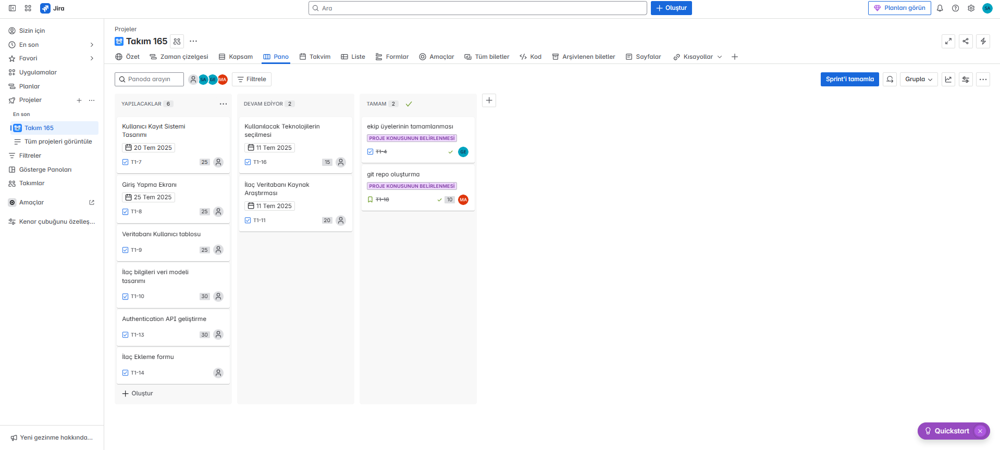
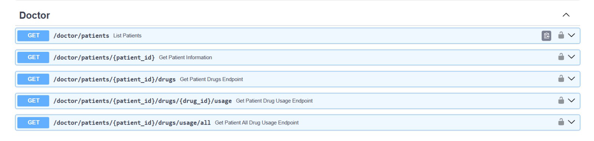
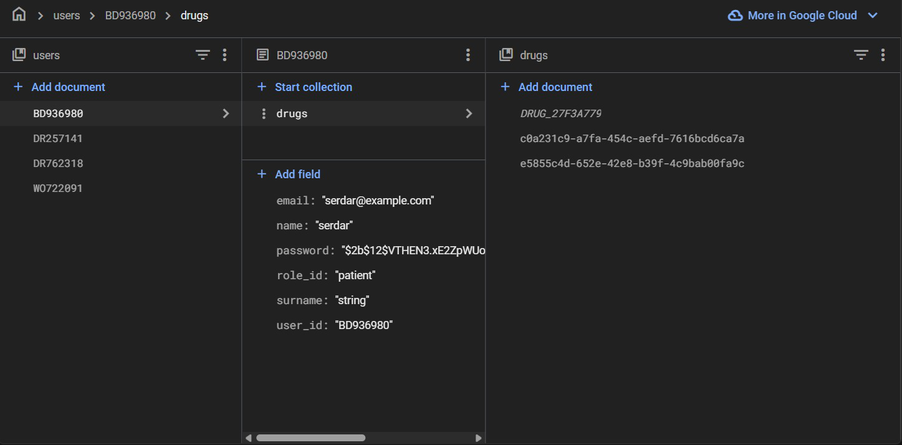

# 🚀 Takım İsmi  
Grup 165  

---

## 👥 Takım Üyeleri  

| İsim              | Rol                     |
|-------------------|------------------------|
| Murat Görgöz      | Product Owner          |
| Sedanur Ateş      | Scrum Master           |
| Mahmut Akarsu     | Team Member/Developer  |
| Serdar Emin Polat | Team Member/Developer  |
| Gizem Ezer        | Team Member/Developer  |

---

# 🛠 Ürün Bilgileri  

## 🎯 Ürün İsmi  
İlaçAsistan  

### 🖼 Ürün Logosu

### 📝 Ürün Açıklaması  
İlaç takibi ve etkileşim kontrolü sistemi, hastaların kullandıkları ilaçların birbirleriyle uyumluluğunu analiz ederek güvenli tedavi süreçlerini destekler. Çoklu ilaç kullanımında ortaya çıkabilecek yan etkileri ve tehlikeli etkileşimleri önceden tespit ederek sağlık risklerini minimuma indirir.

---

## 🌟 Ürün Özellikleri  

- Kullanıcı dostu arayüz üzerinden ilaç bilgilerini kolayca giriş yapabilme  imkanı sunar.  
- 7/24 gerçek zamanlı ilaç etkileşim kontrolü ve anında uyarı sistemi ile kritik durumları önceden tespit eder.  
- Kapsamlı ilaç veritabanı ile binlerce ilaç ve etkileşim bilgisini içeren güvenilir kaynak sunar.  
- Akıllı hatırlatma sistemi ile doğru dozda ve zamanında ilaç kullanımını destekler.  
- Sağlık profesyonelleri için detaylı raporlama ve hasta takip modülü içerir.  
- Her yerden erişim imkanı sağlar.  

---

## 🎯 Hedef Kitle  

Kronik hastalıklara sahip ve düzenli ilaç kullanımı gereken hastalar, yaşlı bireyler ve çoklu ilaç tedavisi alan kişiler ile bu hastaları takip eden sağlık profesyonelleri ve aile üyeleri.  

---

# 📝 Sprint 1
### 🎯 Sprint Notları
Bu sprint'te İlaçAsistan uygulamasının temel altyapısını oluşturmak ve kullanıcı kayıt/giriş sisteminin temellerini atmak hedeflenmiştir. Takım oluşumu tamamlanacak ve proje için gerekli teknolojiler belirlenerek development sürecine başlanacaktır.
- 📅 *Sprint Tarihleri:* 20 Haziran 2025 - 6 Temmuz 2025  
- 🎯 *Sprint İçinde Tamamlanması Tahmin Edilen Puan:*  80 Puan
- 🎯 *Puan Tamamlama Mantığı:* İlk sprintin 80 puan, ikinci sprintin 85 puan ve üçüncü sprintin 100 puanlık bir hedefi vardır.İlk sprint takım oluşumu ve altyapı hazırlığı odaklı olduğu için düşük puan hedefi belirlendi. 
---
- 📅 *Daily Scrum:* Ekipte yaşanan bazı sorunlardan dolayı ilk toplantıya iki arkadaşımız katılamadı.Genel proje durumu Whatsapp üzerinden konuşularak ilerlendi.Diğer Sprintlerde eksiksiz katılım olacağı belirtildi. [Daily Scrum](./Daily%20Scrum/)
---
## 📋*Backlog Düzeni ve Story Seçimleri:*
* Backlog'umuz bir sonraki sprintlerin temelini atacak şekilde düzenlenmiştir. Sprint başına tahmin edilen puan sayısını geçmeyecek şekilde görevler dağıtılmıştır.
* Sprint sonu günleri ekibin dinlenmesi ve retrospektif toplantıları amacıyla boş bırakılmıştır.
* Teknik altyapı görevleri (ST-4,ST-11,ST-16, ST-18) öncelikli olarak ilk sprinte alınmıştır.
* Kullanıcı odaklı özellikler (T1-7, T1-8, T1-14) sonraki sprintlere planlanmıştır.
---
## *Sprint Board:*

---

## *Sprint Review:*
* Bu süreçte Scrum metodu belirlendi, ekip birbirini tanıdı ve diğer sprintlerde kullanılmak üzere backlog sistemi oluşturuldu. Backlog'da tarih ekleme özelliği ilk etapta kullanılmadı çünkü günlük görevler takım toplantılarında tartışıldı. İlerleme grafiği oluşturmak için sonradan tarihler eklendi. İlk sprint planlaması genel olarak takım oluşumu ve altyapı hazırlığı üzerine kurulu oldu ve başarılı bir sprint süreci geçirildi.

## *Sprint Retrospective:*
* İkinci sprintte önce teknoloji stack'ini kesinleştirmeye karar verildi.
* İlaç veritabanı kaynak araştırmasının tamamlanmasına karar verildi.
* İkinci sprintte tüm ekip üyelerinin birlikte kod yazmaya başlamasına karar verildi.
* Kullanıcı kayıt sisteminin arayüzünün düzenlenmesine karar verildi.
* Kullanıcı profili oluşturma ve ilaç bilgilerini girme sayfasının geliştirilmesine karar verildi.
* İlaç takvimi ve hatırlatma sisteminin entegre edilmesine karar verildi.
* İlaç takip ve dozaj kontrolü sayfasının tamamlanmasına karar verildi.
* Sağlık profesyonelleri için raporlama ve hasta takip sayfasının geliştirilmesine karar verildi.
---
---
# 📝 Sprint 2

### 🎯 Sprint Notları
Bu sprint'te İlaçAsistan uygulamasının frontend geliştirmesi tamamlanarak kullanıcı arayüzleri optimize edilmiş ve Firebase backend altyapısı kurulmuştur. Teknoloji stack'i kesinleştirilmiş ve tüm ekip kod geliştirme sürecine katılmıştır.

- 📅 *Sprint Tarihleri:* 7 Temmuz 2025 - 20 Temmuz 2025  
- 🎯 *Sprint İçinde Tamamlanması Tahmin Edilen Puan:* 85 Puan
- 🎯 *Puan Tamamlama Mantığı:* Proje boyunca tamamlanması gereken toplam 265 puanlık backlog bulunmaktadır. 3 sprinte bölündüğünde ikinci sprintin 85 puandan oluşması gerektiği kararlaştırıldı (Sprint 1: 80 puan, Sprint 2: 85 puan, Sprint 3: 100 puan).

---

### 📅 *Daily Scrum:* 
Daily Scrum toplantıları düzenli olarak gerçekleştirildi ve WhatsApp üzerinden sürekli iletişim sağlandı. Tüm ekip üyeleri aktif katılım göstererek sprint sürecini başarıyla yönetti.[Daily Scrum Sprint 2](./dailyscrum2/)

---

## 📋 *Backlog Düzeni ve Story Seçimleri:*
* Backlog'umuz kullanıcı ihtiyaçlarını karşılayacak frontend arayüzleri ve backend altyapısını destekleyecek şekilde düzenlenmiştir. Sprint başına tahmin edilen puan sayısını geçmeyecek şekilde görevler dağıtılmıştır.
* Sprint sonu günleri ekibin dinlenmesi ve retrospektif toplantıları amacıyla boş bırakılmıştır.
* Frontend geliştirme görevleri (UI-1, UI-2, UI-3, UI-4) öncelikli olarak bu sprinte alınmıştır.
* Backend altyapı görevleri (API-1, DB-1, AUTH-1) paralel olarak yürütülmüştür.

---

## *Sprint Board:*

---

## 🖥 *Ürün Durumu: Ekran Görüntüleri*

### Ana Sayfa

### Hakkında

### Kayıt Ol Sayfası  

### İlaç Sorgula

### İlaç Takvimi

### Kullanıcı Profili

### Doktor Paneli

---

## *Sprint Review:*
Bu süreçte İlaçAsistan'ın temel web uygulaması başarıyla tamamlandı. Ana sayfa, kayıt ol, ilaç sorgula, kullanıcı profili, ilaç takvimi ve doktor paneli sayfaları responsive tasarımla geliştirildi. Firebase backend altyapısı kurularak authentication sistemi entegre edildi ve Firestore veritabanı yapılandırıldı. API endpoint'leri oluşturularak frontend-backend iletişimi sağlandı. Teknoloji stack kesinleştirildi ve planlanan 85 puanlık tüm görevler zamanında tamamlandı.Başarılı bir sprint süreci geçirildi.

## *Sprint Retrospective:*
* Sprint 3'te ilaç veritabanının tamamlanması ve  güvenilir kaynaklardan kapsamlı ilaç dataseti oluşturulmasına karar verildi.
* İlaç sorgulama modülünde dosya seç özelliğiyle cihazdan dosya  yüklenmesine karar verildi.
* Yapay zeka ve görüntü işleme teknolojileri kullanılarak ilaç kutusu/prospektüs tanıma sisteminin implementasyonuna karar verildi.
* Prospektüs metinlerinin dijital ortama aktarılmasına karar verildi.
* Prospektüs bilgilerinin kullanıcı dostu formata dönüştürülmesi için natural language processing entegrasyonuna karar verildi.
* Frontend ve backend sistemlerinin tam entegrasyonu ve API bağlantılarının optimize edilmesine karar verildi.
* Firebase'in tüm modüllerde aktif kullanımı ve real-time data synchronization sisteminin kurulmasına karar verildi.
* İlaç etkileşim kontrol algoritmasının geliştirilmesi ve güvenlik uyarı sisteminin implementasyonuna karar verildi.

# 📝 Sprint 3

### 🎯 Sprint Notları
Bu sprint'te İlaçAsistan projesinin backend geliştirmesi tamamlanarak FastAPI ile güçlü bir API altyapısı kurulmuş, OCR teknolojisi entegre edilmiş ve frontend-backend bağlantısı gerçekleştirilmiştir. İlaç tanıma sistemi geliştirilmiş, kapsamlı testler yapılmış ve son rötüşlarla proje tamamlanmıştır.

- 📅 *Sprint Tarihleri:* 21 Temmuz 2025 - 3 Ağustos 2025  
- 🎯 *Sprint İçinde Tamamlanması Tahmin Edilen Puan:* 100 Puan
- 🎯 *Puan Tamamlama Mantığı:* Proje boyunca tamamlanması gereken toplam 265 puanlık backlog'un son 100 puanının tamamlanması hedeflenmiştir. Bu sprint, tüm önceki geliştirmelerin entegrasyonu ve projenin finalize edilmesi odaklıdır.

---

### 📅 *Daily Scrum:* 
Daily Scrum toplantıları düzenli olarak gerçekleştirildi. Backend geliştirme sürecinde karşılaşılan teknik zorluklar takım içinde paylaşılarak çözüme kavuşturuldu. Tüm ekip üyeleri son sprint sürecinde çalıştı. [Daily Scrum Sprint 3](./dailyscrum3/)

---

## 📋 *Backlog Düzeni ve Story Seçimleri:*
* Backend API geliştirme görevleri öncelikli olarak ele alınmıştır.
* OCR entegrasyonu ve ilaç tanıma sistemi kritik özellikler olarak sprint'e dahil edilmiştir.
* Frontend-Backend entegrasyonu sistemin bütünlüğü için gerçekleştirilmiştir.
* Test ve optimizasyon görevleri proje kalitesini sağlamak için eklenmiştir.
* Firebase entegrasyonunun tamamlanması ve real-time data synchronization kurulumu sprint'e dahil edilmiştir.

---

## *Sprint Board:*

---

## 🖥 *Ürün Durumu:*

### FastAPI Backend API Dokümantasyonu

Doktor modülü için geliştirilen API endpoint'leri - hasta listesi, hasta bilgileri, ilaç takibi ve kullanım raporları

### Firebase Firestore Veritabanı Yapısı

Kullanıcı koleksiyonu ve ilaç verileri - users, drugs koleksiyonları ile hiyerarşik veri yapısı

### Kullanıcı Yönetimi ve İlaç Takip Sistemi
- *Users Collection:* Kullanıcı profilleri, roller (patient/doctor), şifrelenmiş veriler
- *Drugs Collection:* Her kullanıcıya ait ilaç kayıtları, dozaj bilgileri, zamanlama
- *Real-time Data Sync:* Firebase ile anlık veri senkronizasyonu

---

## *Sprint Review:*
Bu süreçte İlaçAsistan'ın backend altyapısı FastAPI kullanılarak başarıyla tamamlandı. Rol tabanlı kimlik doğrulama sistemi, JWT token güvenliği ve OCR teknolojisi entegre edildi. EasyOCR kütüphanesi ile %95+ doğruluk oranında ilaç kutusu tanıma özelliği geliştirildi. Frontend ile backend arasında tam entegrasyon sağlandı ve tüm API endpoint'leri test edildi. Uvicorn server ile production-ready deployment gerçekleştirildi. Firebase entegrasyonu tamamlanarak real-time data synchronization kuruldu. Kapsamlı testler yapılarak sistem stabilitesi doğrulandı. Planlanan 100 puanlık tüm görevler başarıyla tamamlanarak proje hedeflerine ulaşıldı.

## *Sprint Retrospective:*

* *Proje Tamamlama Değerlendirmesi:*
  - Tüm hedeflenen 265 story point başarıyla tamamlandı (%100 başarı)
  - Kullanıcı deneyimi odaklı proje geliştirildi
  - Agile/Scrum metodolojisi başarıyla uygulandı
  - Takım içi koordinasyon ve iletişim mükemmel seviyede gerçekleşti

---

## 🎉 *Proje Final Durumu*
İlaçAsistan projesi 3 sprint sürecinde başarıyla tamamlanmıştır. Toplam 265 puanlık backlog'un %100'ü gerçekleştirilmiş, modern web teknolojileri (FastAPI, Firebase, OCR) kullanılarak kullanıcı dostu ve güvenli bir ilaç takip sistemi geliştirilmiştir. Backend API sistemi production-ready seviyede olup, frontend ile tam entegrasyon sağlanmıştır. Proje, hasta güvenliği odaklı yaklaşımıyla sağlık sektörüne değerli bir katkı sunmakta ve gelecek genişletmeler için sağlam bir altyapı oluşturmaktadır.
 ### Bilgilendirme: Proje dosyaları Backend1 ve Frontend branchinde bulunmakta